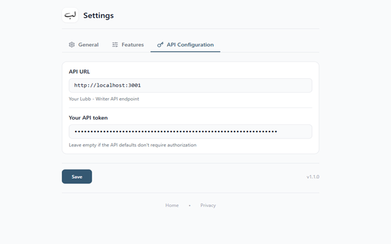
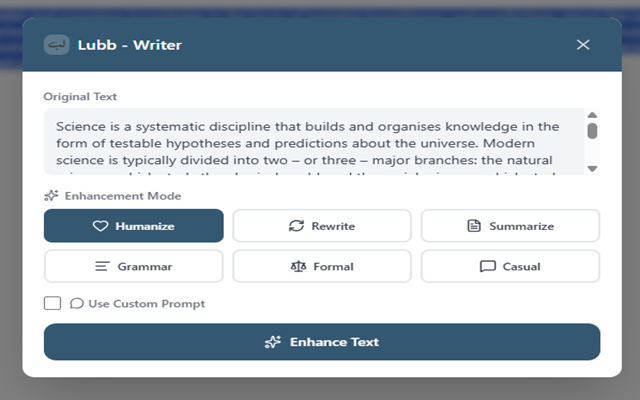
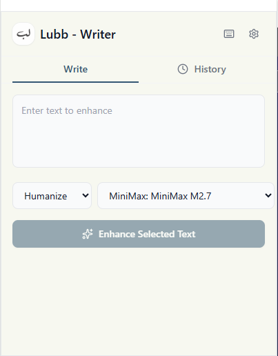
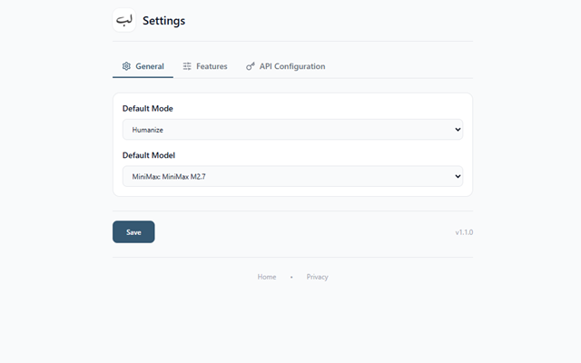

# Lubb - Writer


[](https://opensource.org/licenses/MIT)
[](https://nodejs.org/)
[](https://www.typescriptlang.org/)
[](https://www.docker.com/)

> **Open-source AI writing tool** with 13 enhancement modes, multi-provider support (OpenAI, Claude, Gemini), browser extension & REST API. Self-host for free.

**✨ Transform any text in seconds — rewrite, summarize, humanize, SEO-optimize, or create platform-specific content.**

🔗 **Home Page**: <https://lubb-writer.adelpro.us.kg/>

## Install

Install the browser extension and start enhancing your text in seconds.

| Browser | Link |
|---------|------|
| Chrome | [Chrome Web Store](https://chromewebstore.google.com/detail/lubb-ai-writer/hbdghnimecpnpoomobaeeeeekleanjjo) |
| Firefox | [Firefox Add-ons](https://addons.mozilla.org/en-US/firefox/addon/lubb-ai-writer/) |
| Edge | [Microsoft Edge Add-ons](#) *(coming soon)* |
| Brave | [Chrome Web Store](https://chromewebstore.google.com/detail/lubb-ai-writer/hbdghnimecpnpoomobaeeeeekleanjjo) |

## Screenshots

### API Documentation



### Extension Modal



### Extension Popup



### Settings



## Architecture

```
Browser Extension  ─────>  REST API  ─────>  AI Providers
    (Frontend)              (Express)         OpenAI, Gemini
                                                     Claude, Custom
```

## Features

- **13 Writing Modes**: Rewrite, summarize, humanize, grammar, formal, casual, academic, SEO, persuasive, creative, Twitter, LinkedIn, story
- **Multi-Provider AI**: Use OpenAI, Anthropic Claude, Google Gemini, or add up to 10 custom OpenAI-compatible providers (MiniMax, Ollama, LM Studio, Groq, etc.)
- **Browser Extension**: Enhance text directly from any webpage with inline selection or popup
- **Keyboard Shortcuts**: Enhance selected text with Ctrl+Shift+Y
- **Docker Ready**: Deploy the API anywhere with Docker
- **Interactive Docs**: Swagger UI documentation at `/docs`

## 🚀 Quick Install

```bash
# One-command setup
git clone https://github.com/YOUR_USERNAME/lubb-writer.git && cd lubb-writer && yarn install

# Start the API
yarn dev:api
```

## Projects

### [API](./api/) - REST API Backend

Express.js API with TypeScript for text enhancement.

**Quick Start:**

```bash
cd api
cp .env.example .env
# Edit .env with your API keys
yarn dev
# API available at http://localhost:3001
# Docs at http://localhost:3001/docs
```

### [Extension](./extension/) - Browser Extension

Cross-browser extension for Chrome, Firefox, Edge, and Brave.

**Quick Start:**

```bash
cd extension
yarn install
yarn dev
# Load the extension from build/chrome directory
```

## Quick Start

### Prerequisites

- Node.js 18+
- Yarn 4+
- Docker (optional, for containerized deployment)

### Local Development

```bash
# Install all dependencies
yarn install

# Start API (requires .env configuration)
yarn dev:api

# OR start extension (requires API running)
yarn dev:extension
```

### Production Deployment

```bash
# API only
cd api
docker compose up -d

# Full stack deployment
# Deploy API and configure extension with your endpoint
```

## Documentation

- [API Documentation](./api/README.md)
- [Extension Documentation](./extension/README.md)
- **Interactive API Docs**: Run the API and visit `/docs`

## Tech Stack

**Backend:**

- TypeScript, Express.js, OpenAI SDK, Anthropic SDK, Google Generative AI, Swagger/OpenAPI

**Frontend:**

- TypeScript, React, TailwindCSS, Plasmo (extension framework)

**Infrastructure:**

- Docker, Docker Compose, GitHub Actions (CI/CD)

## License

MIT License - see individual project folders for details.

---

⭐ **Star this repo if you find it useful!** | 🐛 [Report issues](https://github.com/adelpro/lubb-writer/issues) | 📝 [Contributions welcome](https://github.com/adelpro/lubb-writer/pulls)
